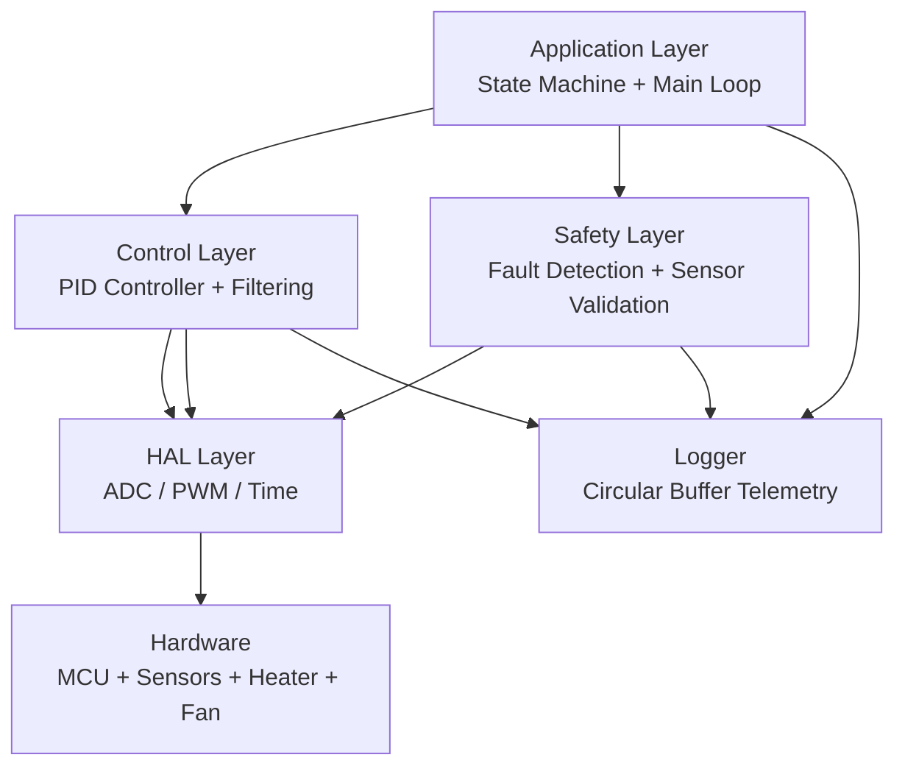

# 🔥 Thermal Control Embedded System

A real-time embedded firmware system simulating a consumer thermal device (hair-styling appliance).

This project demonstrates **industrial embedded system design patterns**, including:
- Hardware Abstraction Layer (HAL)
- PID control with anti-windup
- Safety-critical fault handling
- State machine architecture
- Watchdog supervision
- Circular buffer logging
- Real-time control loop (RTOS-ready)

---

# 🧠 System Architecture

## High-Level Design




## ⚙️ Features

### 🔹 Control System
- PID controller with anti-windup  
- Output ramp limiting  
- Stable thermal regulation  

### 🔹 Safety System
- Over-temperature shutdown  
- Sensor failure detection  
- Redundant validation logic  
- Watchdog-based system recovery  

### 🔹 System Design
- Modular HAL abstraction  
- State machine architecture  
- Real-time loop design  
- Embedded logging system  

---

## 📊 Logging System
- Circular buffer implementation  
- Timestamped telemetry  
- Ready for UART / flash export  

---

## 🧪 Engineering Highlights

- ✔ Embedded C (bare-metal style)  
- ✔ RTOS-ready structure  
- ✔ Safety-critical design thinking  
- ✔ Hardware abstraction separation  
- ✔ Real-time deterministic control  

---

## 📌 Suggested Hardware

- STM32 (Cortex-M4 recommended)  
- TMP36 / NTC thermistor  
- PWM-controlled heater simulation (LED + MOSFET)  
- Optional fan motor (BLDC simulation)  

---

## 🚀 How to Build

```bash
mkdir build
cd build
cmake ..
make
```

(Or integrate into STM32CubeIDE / PlatformIO)

