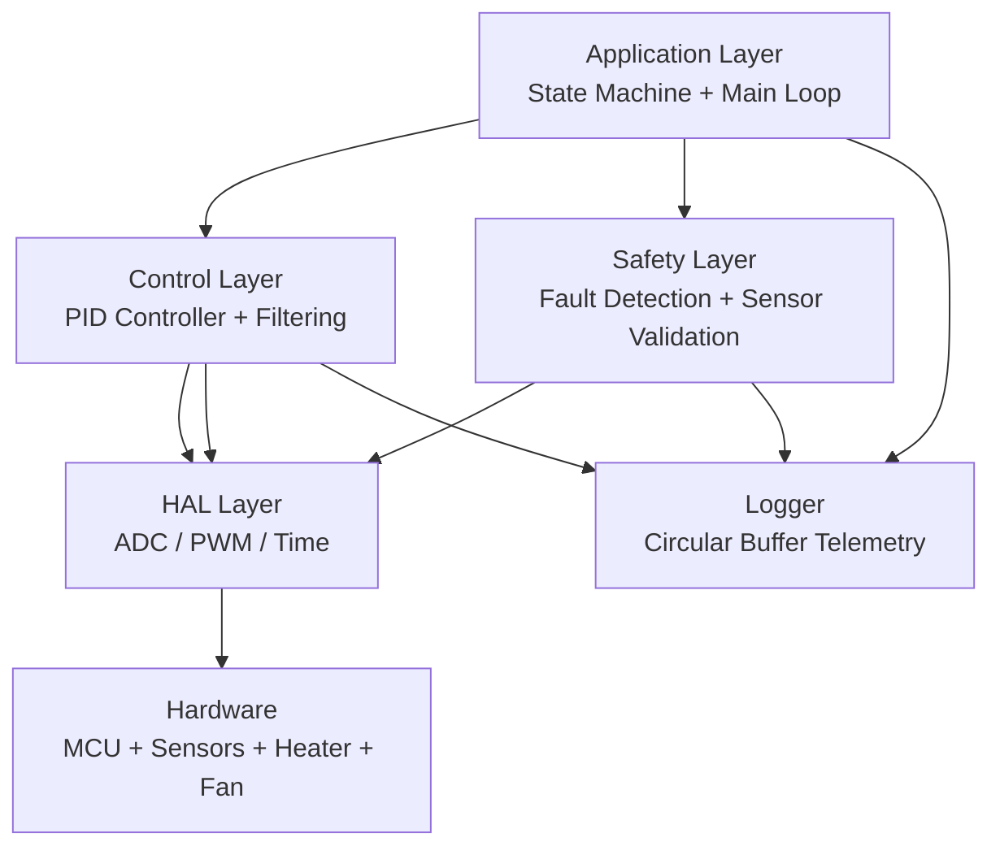

# 🔥 Thermal Control Embedded System

A real-time embedded firmware system simulating a consumer thermal device (hair-styling appliance).

This project demonstrates **industrial embedded system design patterns**, including:
- Hardware Abstraction Layer (HAL)
- PID control with anti-windup
- Safety-critical fault handling
- State machine architecture
- Watchdog supervision
- Circular buffer logging
- Real-time control loop (RTOS-ready)

---

# 🧠 System Architecture

## High-Level Design

