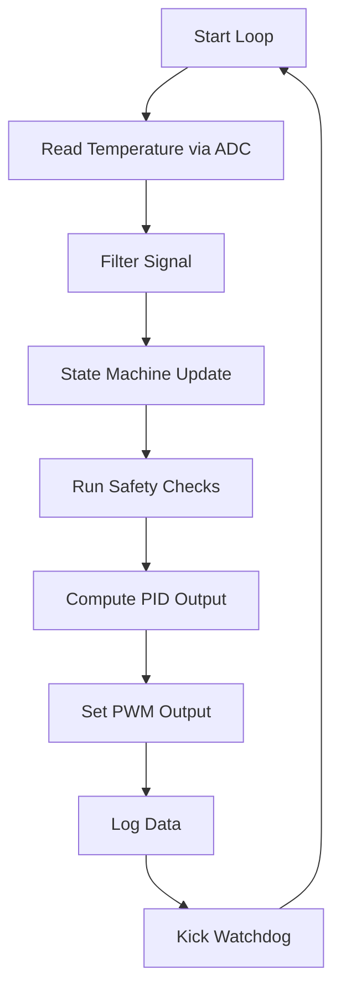

```mermaid
flowchart TD
    S[Start Loop] --> R[Read Temperature via ADC]
    R --> F[Filter Signal]
    F --> SM[State Machine Update]
    SM --> SAFETY[Run Safety Checks]
    SAFETY --> PID[Compute PID Output]
    PID --> PWM[Set PWM Output]
    PWM --> LOG[Log Data]
    LOG --> WD[Kick Watchdog]
    WD --> S
```
